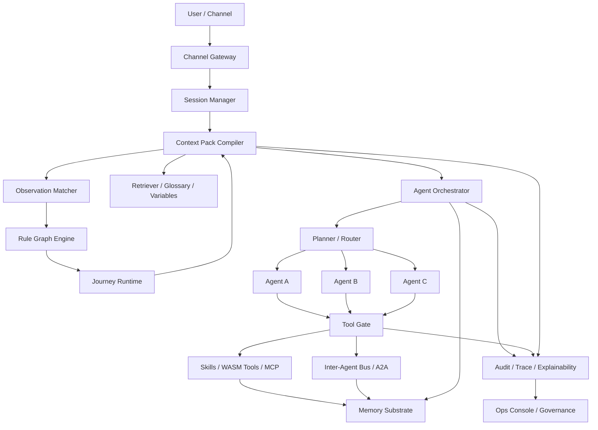

可以，而且这两个项目**非常适合做“上下分层融合”**，但我不建议你把它们当成两个同类框架去“硬合并”。更合理的目标是：**把 Parlant 的“对话语义控制能力”抽象成上层控制面，把 OpenFang 的“Agent 运行时/通道/技能/调度/安全”抽象成下层执行面，然后用 Rust 重做一个企业级统一内核。** 这么做的原因是，Parlant本质上是面向客户交互的“conversational control layer”，核心是 observations / guidelines / journeys / retrievers / glossary / variables / canned responses 这套上下文控制机制；OpenFang则明确把自己定义成“Agent Operating System”，强调 Rust、单二进制、工作区多 crate、channels、skills、MCP/A2A、scheduler、RBAC、budget、audit 和 sandbox。两者关注点天然互补。([GitHub](https://github.com/emcie-co/parlant))

我先给你一个结论：**最终产品形态不应是“Parlant + OpenFang 的混合物”，而应是一个新的 Rust 底座**。其中，Parlant 贡献的是**语义治理模型**，OpenFang 贡献的是**系统运行模型**。原因也很现实：Parlant 现在公开仓库主体语言仍是 Python，且其服务暴露方式围绕 FastAPI/生产部署/OTel 展开；OpenFang 则本来就是 Rust 工作区，公开强调 14-crate 架构、运行时、安全层和 API 面。你要“用 Rust 语言”做企业级底座，正确路线不是把 Parlant 直接嵌进去，而是**把 Parlant 的设计哲学 Rust 化**。([GitHub](https://github.com/emcie-co/parlant))

### 一、我建议的总体定位

把目标底座定义为：

**“面向企业生产场景的多-Agent 语义控制与执行操作系统”**

它分三层：

1. **语义控制层（来自 Parlant 思想）**
  负责“什么时候该把什么信息、规则、工具、SOP 放进当前轮上下文”。核心对象是 observation、guideline、relationship、journey、retriever、glossary、variable、canned response。Parlant 的关键价值就在这里：它不是把所有规则和工具一股脑塞进 prompt，而是按轮次只注入相关内容，从而控制上下文污染和工具误调用。([parlant.io](https://parlant.io/docs/concepts/customization/guidelines/))
2. **执行运行层（来自 OpenFang 思想）**
  负责“agent 怎么活起来并持续运行”。包括 agent loop、workflow、skills、hands、memory、scheduler、channels、MCP/A2A、RBAC、budget、audit、WASM sandbox。OpenFang 对企业底座最有价值的不是某个单点特性，而是它已经把“agent 不是 prompt，而是操作系统中的一个运行实体”这件事做成了系统形态。([GitHub](https://github.com/RightNow-AI/openfang))
3. **企业治理层（你们真正需要补强的部分）**
  多租户、策略版本化、审批流、灰度、审计追责、成本看板、敏感信息治理、人工接管、知识/流程/技能生命周期管理。这部分 Parlant 和 OpenFang 都各有覆盖，但都还不是完整企业平台。Parlant官方文档明确强调 production、API hardening、human handoff、observability；OpenFang则强调 RBAC、budget tracking、security systems、Merkle audit trail、taint tracking。真正企业级，要把这些治理能力做成一等公民。([parlant.io](https://parlant.io/docs/category/production/))

### 二、两边能力怎么映射

我建议你按下面思路“嫁接”：

- **Parlant 的 observation → 你的 Policy Sensor**
- **Parlant 的 guideline → 你的 Policy Rule**
- **Parlant 的 relationship → 你的 Rule Graph / Constraint Graph**
- **Parlant 的 journey → 你的 SOP / Business Flow Runtime**
- **Parlant 的 retriever / glossary / variables → 你的 Context Pack Compiler**
- **Parlant 的 canned responses / explainability → 你的 Guarded Response / Trace UI**
- **OpenFang 的 skills → 你的 Tool / Capability Package**
- **OpenFang 的 hands → 你的 Background Agents / Long-running Workers**
- **OpenFang 的 channels → 你的 Channel Gateway**
- **OpenFang 的 MCP/A2A → 你的 External Capability Bus / Inter-Agent Bus**
- **OpenFang 的 kernel/runtime → 你的 Agent OS Kernel**
- **OpenFang 的 memory → 你的 Multi-tier Memory Substrate** ([parlant.io](https://parlant.io/docs/concepts/customization/guidelines/))

这意味着，**Parlant 决定“本轮该让模型知道什么、允许做什么”**，而 **OpenFang 决定“这些 agent/skills/tools/workflows/channels 如何被真正执行、调度、审计和治理”**。这就是你要的“企业级多-agent底座”的正确拆分。

### 三、建议的目标架构

这个图里最关键的是 **Context Pack Compiler**。它是你把 Parlant 思想 Rust 化后的核心中枢：每一轮先不急着让 LLM 说话，而是先编译一个“当前轮最小充分上下文包”。

### 四、最核心的运行闭环

你这个底座的每一轮对话，建议固定走 8 步：

1. **Channel ingress**
  Web / API / Feishu / 企业微信 / Slack 等通道进入，统一成 Canonical Message。OpenFang 的 channel adapter 思路很适合作为这里的参考，但企业落地时先做少数高价值通道，不要一开始就追 40+ adapter。([OpenFang](https://www.openfang.sh/docs/channel-adapters?utm_source=chatgpt.com))
2. **Session hydrate**
  读取 session、用户画像、租户配置、历史摘要、业务状态、active journey、已触发规则、可用工具预算。
3. **Observation matching**
  先跑 deterministic matcher，再跑 semantic matcher。Parlant 的 observation 本质就是“传感器”，先做检测，再决定哪些规则/工具/检索器/旅程该进入上下文。([parlant.io](https://parlant.io/docs/concepts/customization/guidelines/))
4. **Rule graph resolve**
  处理 depend_on / exclude / prioritize_over 这类关系，算出本轮真正生效的 policy set。Parlant 已经证明这类“规则之间的关系”很关键，否则规则一多就会打架。([parlant.io](https://parlant.io/docs/concepts/customization/guidelines/))
5. **Journey/SOP resolve**
  如果命中某个业务流程，则把当前 flow state、下一步候选动作、跳转条件、完成条件一起编译进 context。Parlant 的 journeys 不是死板流程，而是“可跳步、可回退、可变速”的 SOP，这一点非常适合企业客服/电销/工单场景。([GitHub](https://github.com/emcie-co/parlant))
6. **Tool gating / capability exposure**
  这里必须采用 Parlant 的思想：**工具不是默认全量可见，而是按 observation / policy 条件注入**。这会显著减少错误工具调用和“会调用但不该调用”的问题。([parlant.io](https://parlant.io/docs/concepts/customization/tools/))
7. **Agent orchestration**
  Router 选择 default agent / specialist agent / verifier agent / recovery agent。这里借 OpenFang 的 runtime、workflow、A2A、skills、hands 模式，但前台对话 path 和后台 autonomous hand 必须分开。([GitHub](https://github.com/RightNow-AI/openfang))
8. **Audit + state update**
  写入审计链、状态变量、成本、工具调用结果、session labels、journey state、human handoff suggestion。Parlant 已经在 sessions / labels / explainability 上持续增强；OpenFang 也强调 audit trail、RBAC、budget。你的企业版要把这一步做成强约束，而不是日志附带品。([GitHub](https://github.com/emcie-co/parlant/blob/develop/CHANGELOG.md))

### 五、Rust 里应该怎么拆 crate

我建议你不要直接照搬 OpenFang 的 crate 名，而是重新定义成你自己的企业底座工作区。可以参考下面这版：

- `openparlant-types`
核心类型：TenantId、AgentId、SessionId、PolicyId、JourneyId、ToolId、CapabilityId、TraceId、Budget、Labels、Taint、ModelSpec
- `openparlant-policy`
Observation / Guideline / Relationship / RuleGraph / Matching API
这是 **Parlant 语义内核** 的 Rust 实现
- `openparlant-context`
Retriever、Glossary、Variables、Prompt Assembly、Context Pack Compiler
- `openparlant-journey`
SOP DSL、Journey State Machine、Adaptive transitions、Field dependencies
- `openparlant-runtime`
Agent loop、router、planner、verifier、response composer
- `openparlant-tools`
Tool registry、tool contracts、tool guard、approval hooks
- `openparlant-skills`
技能包格式，建议支持三类：Rust native、WASM、MCP remote
- `openparlant-memory`
Session memory、episodic summary、semantic memory、vector index、compaction
- `openparlant-kernel`
多租户、RBAC/ABAC、scheduler、budget、quota、hot-reload、config
- `openparlant-channels`
WebSocket、REST、Feishu、企业微信、Slack、Email connector
- `openparlant-a2a`
Agent 间消息协议、handoff contract、work delegation、result return
- `openparlant-api`
Axum API、WS/SSE streaming、admin API、ops API
- `openparlant-console`
管理台 / Trace UI / Policy Studio / Journey Studio / Skill Registry
- `openparlant-audit`
审计链、PII redaction、trace exporter、OpenTelemetry bridge

这套拆法，本质上是把 OpenFang 的 kernel/runtime/channels/memory/skills/api 思路保留，同时把 Parlant 的 policy/context/journey 抽成一等核心。OpenFang 自己公开的 crate 责任划分已经证明这种 workspace 化是可行的。([GitHub](https://github.com/RightNow-AI/openfang/blob/main/CONTRIBUTING.md?utm_source=chatgpt.com))

### 六、几个关键设计选择，我建议你这么定

**1）前台对话 agent 和后台 autonomous hands 分层**
OpenFang 的 Hands 很适合做研究员、巡检、情报收集、定时任务，但你做企业多-agent底座时，千万别让前台客服对话 path 直接复用后台 autonomous loop。前台要的是低延迟、强可控、强审计；后台要的是长任务、计划执行、调度和异步。两条链路应该共用底层 runtime 与 skills，但上层控制逻辑分开。([OpenFang](https://www.openfang.sh/docs/hands?utm_source=chatgpt.com))

**2）Skill 不要默认走 Python，优先 Rust Native + WASM + MCP**
你既然目标是 Rust 企业底座，就不要把技能生态又拉回“外部 Python 子进程拼装”。OpenFang 明确强调 WASM sandbox、MCP、工具运行安全；这正好给你一个方向：

- 高频核心工具：Rust native
- 不可信/第三方工具：WASM
- 外部平台能力：MCP
这样安全边界、资源限制、部署一致性都会更稳。([GitHub](https://github.com/RightNow-AI/openfang))

**3）工具暴露必须条件化，不要全量注册到当前轮**
这是我认为你从 Parlant 必须完整继承的一个思想。它直接解决企业对话系统里最常见的两个问题：乱调工具、误走流程。Parlant 文档对这一点写得非常明确：tools 是上下文投递系统的一部分，应该只在相关 observation 命中时进入上下文。([parlant.io](https://parlant.io/docs/concepts/customization/tools/))

**4）SOP 应该是“自适应流程”，不是死状态机**
企业业务流程如果写成传统流程图，很快会在真实对话里失效。Parlant 的 journeys 之所以值得学，是因为它允许 agent 在结构化流程内“跳步、回退、调速”。你可以在 Rust 里实现成“显式状态 + 软跳转候选 + 约束检查”的混合模式。([GitHub](https://github.com/emcie-co/parlant))

**5）Explainability 不要只做 tracing，要做“策略解释”**
Parlant 不只是观察日志，还强调 enforcement / explainability；OpenFang 强调 audit trail。企业要的不是“发生了什么”，而是“为什么这轮只有这些规则生效、为什么这个工具被允许、为什么走了这个 handoff”。这部分要在 Trace UI 里能直接看到：命中的 observations、被排除的 rules、active journey node、工具授权来源、模型响应草稿和最终选择。([parlant.io](https://parlant.io/docs/category/production/))

### 七、企业版必须额外补的能力

我会把下面这些列为**必须做**，而不是“后续再说”：

- **多租户隔离**：tenant、workspace、env、policy namespace、skill namespace、knowledge namespace
- **策略版本化**：policy/journey/skill/retriever 全部 versioned，可灰度、可回滚
- **审批门**：高风险 tool call、外发消息、工单提交、支付/退款类动作必须 approval gate
- **预算治理**：token、工具调用、第三方 API 成本、租户配额
- **PII 与合规**：脱敏、最小暴露、按角色可见
- **人工接管**：handoff to human、回灌处理结果、对话冻结/解冻
- **质量闭环**：离线回放、bad case 标注、规则冲突分析、journey 漏斗分析
- **策略工作台**：让产品/运营/算法都能管理 observation/rule/journey，而不是全靠写代码

这些能力和 Parlant 的 production / human handoff / observability 方向、以及 OpenFang 的 RBAC / scheduler / budget / audit / security 方向是一致的，但需要你做成更完整的平台层。([parlant.io](https://parlant.io/docs/category/production/))

### 八、我建议的落地路线

**Phase 1：先做“对话型企业底座”，不要一上来做全自动 Agent OS**
先落四个最值钱的子系统：

- Policy Engine（observation/guideline/relationship）
- Journey Runtime（SOP）
- Tool Gate（条件暴露 + 审批 + 审计）
- Session/Trace（状态与可解释）

这一步就已经能支撑客服、电销、工单协同、知识问答、流程办理。Parlant 的核心价值此时能最快转化成业务收益。([parlant.io](https://parlant.io/docs/concepts/customization/guidelines/))

**Phase 2：再补 OpenFang 风格的系统能力**
加上：

- skills registry
- scheduler
- background hands
- MCP/A2A
- channel adapters
- dashboard / ops console

这时你的系统才从“可控对话引擎”升级为“多-agent底座”。([GitHub](https://github.com/RightNow-AI/openfang))

**Phase 3：最后做 enterprise operations**
包括多租户治理、权限、预算、灰度、审计、回放、质量闭环、运营工作台。这一步做完，才是真正能在企业里长期跑的底座。([parlant.io](https://parlant.io/docs/category/production/))

### 九、哪些地方不要照搬

第一，**不要照搬 OpenFang 的全部 channel/hand/skill 生态**。OpenFang 很强，但它自己 README 也明确说目前仍然 pre-1.0，建议生产 pin commit；所以你可以学它的架构，但不建议直接深度绑定其全部快速演进面。([GitHub](https://github.com/RightNow-AI/openfang))

第二，**不要把 Parlant 当成“另一个路由器框架”**。Parlant真正厉害的是 context engineering 与 alignment-style control，而不是简单意图路由。它自己在 motivation 文档里就明确反思了“只靠 intent-based graph routing”的局限。([parlant.io](https://parlant.io/docs/quickstart/motivation/?utm_source=chatgpt.com))

第三，**不要把“多 agent”理解成“多 LLM 节点串起来”**。企业里最有价值的不是 agent 数量，而是：规则是否可治理、流程是否可收敛、工具是否可审计、知识是否可控、成本是否可管。Parlant 和 OpenFang 的共同启发其实都是“把 agent 系统工程化”。([parlant.io](https://parlant.io/docs/category/production/))

### 十、我的最终建议

如果这个项目由我来定总方案，我会定成下面这句：

**“以 Parlant 的语义控制模型为上层控制面，以 OpenFang 的 Rust 运行时/技能/通道/安全模型为下层执行面，重构一个面向企业生产场景的 Agent OS。”**

一句话说得更直白一点：

**Parlant 负责‘别乱说、别乱做、按规则做’；OpenFang 负责‘真的能跑、能接通道、能调工具、能审计、能运维’。**

这就是最自然、也最有工程落地价值的融合方式。([GitHub](https://github.com/emcie-co/parlant))

顺便补一句，许可证层面目前看**没有明显阻塞**：Parlant 仓库公开为 Apache 2.0，OpenFang 仓库显示 MIT 与 Apache-2.0 许可文件都存在；但如果你准备直接复制源码而不只是参考设计，还是要在内部法务/合规流程里核一遍 NOTICE、版权声明和二次分发要求。([GitHub](https://github.com/emcie-co/parlant))

下一步我建议直接进入实操：**我可以继续给你出一版完整 PRD + 技术架构设计文档，包含模块清单、crate 目录、核心数据结构、接口协议和多-agent执行时序图。**