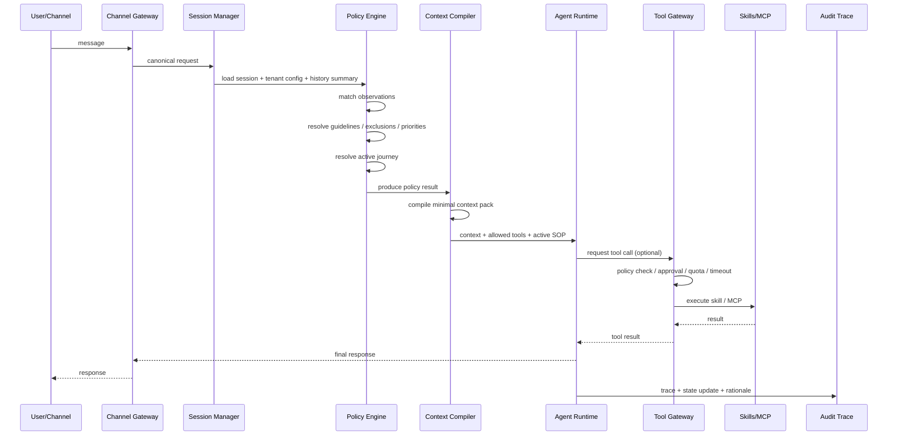

好，下面我直接把“下一步”收敛成**一版可开工的企业级多-Agent Rust 底座设计稿**。

先定一句总纲：

**Parlant 提供“语义控制面”，OpenFang 提供“执行运行面”，你们的新底座要做的是把二者统一成一个 Rust 的 Agent OS。**
Parlant 的核心是 observations / guidelines / journeys / tools 这套上下文控制体系；OpenFang 的核心是 Rust 运行时、Hands、skills、channels、MCP/A2A、安全和运维。官方资料也基本印证了这种分工：Parlant把自己定位成 customer-facing AI agents 的 conversational control layer，强调 observation 控制上下文注入、journeys 做自适应 SOP；OpenFang把自己定位成 Rust 写的 Agent Operating System，强调 one binary、14 crates、Hands、skills、40+ channels、MCP/A2A 和安全体系。([GitHub][1])

---

## 1. 先把产品边界拍板

我建议这个底座的 **V1 定位** 不要写成“通用 autonomous agent 平台”，而要写成：

**“面向企业客服/销售/工单/运营场景的可控多-Agent底座”**

原因很简单：
Parlant 天生适合“强规则、强SOP、强解释”的客户交互场景，它文档里对 guideline、journey、human handoff 的强调都说明它更偏企业交互控制；OpenFang虽然支持 autonomous Hands、workflows、MCP/A2A 和多通道，但 GitHub README 也明确说目前 feature-complete 但仍 pre-1.0，建议生产上 pin commit。也就是说，V1 更适合先落到**企业对话 + 工具执行 + 审计闭环**，而不是一开始追求全自动自治代理。([parlant.io][2])

所以 V1 我建议聚焦四类场景：

1. 智能客服
2. 智能电销/回访
3. 工单/流程办理
4. 企业知识问答 + 操作执行

这四类场景共同点是：
**要可控、要走流程、要调工具、要可审计、必要时要人工接管。**
这正好把 Parlant 和 OpenFang 的长处都用上。([parlant.io][3])

---

## 2. 目标架构：控制面 + 执行面 + 治理面

我建议你把系统拆成三大面：

### 2.1 控制面（吸收 Parlant）

负责决定：

* 当前轮哪些规则生效
* 当前轮哪些知识该进上下文
* 当前轮能暴露哪些工具
* 当前对话是否进入某个 SOP/journey
* 当前是否应该转人工/升级

Parlant 文档很清楚：
observation 是“sensor”，负责检测；guideline 是“condition + action”；journeys 是多轮 SOP，而且是自适应的，不是死板状态机；tools 也可以被 observation 控制是否进入上下文。([parlant.io][3])

### 2.2 执行面（吸收 OpenFang）

负责真正运行：

* agent loop
* router / planner / verifier
* skill / tool 执行
* channel adapter
* MCP / A2A
* scheduler / background hands
* memory / audit / budget

OpenFang 官方材料明确把这些放在 Agent OS 里：Rust、14 crates、single binary、Hands、HAND.toml、SKILL.md、guardrails、channels、API、MCP/A2A、安全系统。([GitHub][4])

### 2.3 治理面（你们自己补齐）

这是企业底座和开源 demo 的分水岭，必须是一等公民：

* 多租户
* 策略版本化
* 审批流
* 配额/预算
* 审计
* 灰度与回滚
* 人工接管
* 回放与坏例分析
* 运营工作台

Parlant官方已经把 production、observability、human handoff 放进正式文档；OpenFang也强调安全、审计、配置、API 和平台化能力。([dev.parlant.io][5])

---

## 3. 我建议的 Rust 工作区结构

你不该直接照搬 OpenFang 的 crate 名，而应该做自己的企业版 workspace。推荐这样拆：

```text
openparlant/
├── crates/
│   ├── core-types
│   ├── policy-engine
│   ├── context-compiler
│   ├── journey-runtime
│   ├── agent-runtime
│   ├── router-planner
│   ├── tool-gateway
│   ├── skill-runtime
│   ├── memory-store
│   ├── channel-gateway
│   ├── a2a-bus
│   ├── audit-trace
│   ├── security-guard
│   ├── tenant-governance
│   ├── api-server
│   └── admin-console-backend
├── apps/
│   ├── server
│   ├── worker
│   └── cli
└── web/
    └── admin-console
```

### 各模块职责

**core-types**
统一 ID、session、tenant、policy、journey、tool、trace、budget、approval 等领域模型。

**policy-engine**
对应 Parlant 的 observation / guideline / relationship。
这是整个系统最值钱的模块之一。

**context-compiler**
把 observation 命中结果、guideline、journey、retriever、glossary、variables 编译成“本轮最小上下文包”。

**journey-runtime**
实现自适应 SOP，而不是硬编码流程图。

**agent-runtime**
执行 agent loop，支持 default agent / specialist / verifier / recovery agent。

**tool-gateway**
负责工具暴露、权限校验、审批、审计、超时、重试、熔断。

**skill-runtime**
建议支持三种技能形态：

* Rust native
* WASM sandbox
* MCP remote

**channel-gateway**
统一 Web / API / Feishu / 企业微信 / Slack 等通道。

**a2a-bus**
agent 间协作，支持 handoff、delegation、result return。

**audit-trace**
保存“为什么这么做”的解释链，不只是普通日志。

**tenant-governance**
多租户、版本、灰度、配额、预算、角色权限。

这套拆法的原则，是**把 Parlant 的控制逻辑内核化，把 OpenFang 的运行逻辑系统化**。Parlant 和 OpenFang公开材料都支持这种分层思路。([parlant.io][3])

---

## 4. 核心领域模型，先定这些

下面这些对象建议你尽早固化，否则后面会反复改。

### 4.1 Observation

```rust
pub struct Observation {
    pub id: ObservationId,
    pub tenant_id: TenantId,
    pub name: String,
    pub matcher: MatcherSpec,      // NLP / Regex / Code / Embedding / DSL
    pub effect_targets: Vec<EffectTarget>,
    pub priority: i32,
    pub enabled: bool,
}
```

它的职责不是“直接告诉 agent 怎么说”，而是**检测当前轮命中了什么情境**。这和 Parlant 的 observation 语义一致。([parlant.io][3])

### 4.2 Guideline

```rust
pub struct Guideline {
    pub id: GuidelineId,
    pub tenant_id: TenantId,
    pub condition_ref: ObservationRef,
    pub action: String,
    pub duration: GuidelineDuration, // OneOff / Persistent / WhileCondition
    pub depends_on: Vec<GuidelineId>,
    pub excludes: Vec<GuidelineId>,
    pub priority_over: Vec<GuidelineId>,
}
```

Parlant 文档明确区分了 guideline duration，并支持 depend_on / exclude 这种关系，这一点非常适合企业规则治理。([parlant.io][3])

### 4.3 Journey

```rust
pub struct Journey {
    pub id: JourneyId,
    pub tenant_id: TenantId,
    pub name: String,
    pub trigger: TriggerSpec,
    pub states: Vec<JourneyState>,
    pub transitions: Vec<JourneyTransition>,
    pub completion_rule: CompletionRule,
}
```

要点不是状态机本身，而是**允许跳步、回退、调速**。Parlant 明确说 journeys 是 adaptive 的，不是 rigid flow。([parlant.io][6])

### 4.4 Tool Exposure Policy

```rust
pub struct ToolPolicy {
    pub tool_id: ToolId,
    pub exposed_when: Vec<ObservationRef>,
    pub approval_mode: ApprovalMode,
    pub risk_level: RiskLevel,
    pub tenant_scope: TenantScope,
}
```

也就是“工具并不天然可见”。只有 observation 命中时，某些工具才进入当前轮上下文。这个思想直接沿用 Parlant。([parlant.io][3])

### 4.5 Hand / Background Agent

```rust
pub struct HandSpec {
    pub id: HandId,
    pub name: String,
    pub schedule: ScheduleSpec,
    pub required_skills: Vec<SkillId>,
    pub metrics: Vec<MetricDef>,
    pub guardrails: Vec<Guardrail>,
}
```

这里借 OpenFang 的 Hands、HAND.toml、guardrails 思想，但你们要把它和前台实时对话 agent 分开。OpenFang把 Hands定义为按计划独立运行的能力包，而不是聊天机器人。([GitHub][4])

---

## 5. 请求主链路，我建议固定成这个时序



这条链路的关键不是“多 agent 并行”，而是**先 policy，再 context，再 agent，再 tool，再 audit**。
这和很多“先让模型自己想，再补救”的框架不同。Parlant 的价值就在于把控制逻辑前置；OpenFang 的价值在于把执行/工具/通道/安全做成系统层。([parlant.io][3])

---

## 6. 多-Agent 怎么设计才不乱

我建议 V1 只保留四种 agent 角色，先别做太多：

### 6.1 Default Agent

负责主应答。

### 6.2 Specialist Agent

用于特定领域，例如：

* 售前
* 售后
* 工单办理
* 合同/账务
* 风控说明

### 6.3 Verifier Agent

不直接回答用户，只做：

* 工具调用结果校验
* 高风险响应复核
* 规则冲突复核

### 6.4 Recovery Agent

当 default agent 失败、上下文不够、规则冲突、工具报错时，负责兜底。

不要一开始就做十几个 agent。
企业系统的关键不是 agent 多，而是**角色边界清晰、handoff 可审计、状态不丢失**。

### handoff 规则建议

* 普通意图切换：router 自动切
* 高风险操作：必须 verifier 复核
* 连续失败/用户强烈不满/规则无法满足：触发人工接管
* 人工接管时：session 切 manual mode

Parlant 的 human handoff 文档就明确建议通过工具把 session 切到 manual mode，并与外部工单/客服系统集成。([parlant.io][2])

---

## 7. 技能体系怎么设计

我建议技能分三级：

### Level 1：Rust Native Skill

适合高频、核心、强性能场景：

* CRM 查询
* 工单查询/提交
* 合同信息获取
* 用户标签读写
* 风控策略查询

### Level 2：WASM Skill

适合需要隔离的三方或高风险执行：

* 网页抓取
* 文件转换
* 不可信脚本
* 外部插件能力

### Level 3：MCP Remote Skill

适合外部系统：

* IDE / 开发工具
* 知识工具
* 第三方 SaaS
* 外部 agent 系统

OpenFang 官方文档明确强调 MCP/A2A 和技能生态；它的 Hands 也把 SKILL.md 当作运行时注入的领域知识。你们可以把这套思想做成“技能 + 能力说明 + 授权 + 审计”的统一包格式。([OpenFang][7])

---

## 8. 管理台必须有哪些页面

这个很重要，因为企业底座最后不是代码炫技，而是管理能力。

我建议管理台 V1 至少有这 8 个页面：

### 8.1 Agent 管理

* agent 列表
* 路由策略
* 模型配置
* fallback 策略

### 8.2 Policy Studio

* observations
* guidelines
* relationships
* 命中测试
* 冲突分析

### 8.3 Journey Studio

* SOP 编辑
* 状态/转移条件
* 字段依赖
* 完成条件
* 漏斗分析

### 8.4 Skill Registry

* 技能注册
* 输入输出 schema
* 风险等级
* 审批策略
* 调用统计

### 8.5 Channel 管理

* Web/API/Feishu/企微/Slack
* 路由绑定
* 身份映射
* 限流配置

### 8.6 Session & Trace

* 对话回放
* 命中的 observation/guideline
* active journey
* 允许的 tools
* tool 调用链
* 最终 response rationale

### 8.7 Governance

* 多租户
* 角色权限
* 配额
* 成本
* 灰度
* 版本回滚

### 8.8 Human Handoff Console

* 待人工接管会话
* 转接原因
* AI 摘要
* 工具执行记录
* 继续处理入口

Parlant 的 production/human handoff 路线和 OpenFang 的 API/配置/安全/通道文档，都说明这类页面不是附属功能，而是企业落地的主战场。([dev.parlant.io][5])

---

## 9. 数据存储建议

### 9.1 PostgreSQL

存：

* tenant
* session metadata
* policy/journey definitions
* tool registry
* approval records
* audit index

### 9.2 Redis

存：

* session hot state
* rate limit
* short-lived cache
* distributed lock

### 9.3 Object Storage

存：

* conversation transcript archive
* replay snapshot
* skill package
* workflow artifact

### 9.4 Vector Store / Semantic Index

存：

* glossary
* retriever corpus
* episodic memory
* bad-case retrieval

### 9.5 ClickHouse / OLAP

存：

* tool latency
* token cost
* rule hit rate
* handoff funnel
* business KPI dashboard

---

## 10. V1 非功能目标

这部分建议你直接写进 PRD/架构设计：

* 单租户日均会话量：先按 10 万级设计
* 对话链路 P95：2~4 秒内首响
* 工具调用超时：默认 3~5 秒，可配置
* 审计日志：全量留痕
* 策略变更：支持版本化 + 灰度
* 高风险动作：必须审批
* 多模型支持：OpenAI / Anthropic / Gemini / 自建推理服务
* 高可用：api-server 与 worker 分离，可水平扩缩

OpenFang 官方资料里对 API、配置、模型提供方、通道、技能数量的强调，说明这种平台型非功能目标是必须正面设计的。([OpenFang][8])

---

## 11. 我建议的实施路线

### Phase 0：两周内完成设计冻结

产出：

* PRD
* 架构设计
* 核心对象模型
* API 契约
* 目录结构
* 风险清单

### Phase 1：先做“可控对话引擎”

只做：

* policy-engine
* context-compiler
* journey-runtime
* session/trace
* 基础 tool-gateway
* Web/API channel

这一阶段，本质上是把 Parlant 思想 Rust 化。
只要这一步成了，你就已经不是普通聊天框架了。([parlant.io][3])

### Phase 2：补多-Agent执行与技能体系

加入：

* agent-runtime
* router/planner
* verifier/recovery agent
* skill-runtime
* MCP
* A2A
* scheduler
* background hands

这一阶段吸收 OpenFang 的运行模型。([GitHub][4])

### Phase 3：补企业治理

加入：

* RBAC/ABAC
* 审批中心
* 人工接管
* 灰度/回滚
* 成本与预算
* 管理台全功能
* 回放与坏例分析

### Phase 4：做行业模板化

沉淀：

* 客服模板
* 电销模板
* 工单模板
* 保险/金融/零售模板

---

## 12. 这条路线最大的三个风险

### 风险 1：把“多 agent”做成了“多 prompt”

这是最常见的坑。
解决办法：agent 必须绑定角色、状态、可见工具、可用 policy，而不是只有 system prompt。

### 风险 2：规则、SOP、工具三套体系互相打架

解决办法：所有执行都统一走：
**observation → guideline/journey → tool exposure → runtime**
不要各搞一套逻辑。

### 风险 3：后台 autonomous hands 和前台实时对话串了线

解决办法：
前台链路追求低时延、强可控；
后台链路追求长任务、调度、自主执行。
底层复用，控制层分离。

---

## 13. 我建议你现在就定下来的技术决策

1. **语言：Rust**
2. **HTTP/WS：Axum**
3. **异步：Tokio**
4. **序列化：Serde**
5. **数据库：PostgreSQL + Redis**
6. **OLAP：ClickHouse**
7. **消息队列：NATS 或 Kafka**
8. **WASM：Wasmtime**
9. **策略 DSL：TOML/YAML + UI 可视化编辑**
10. **前端控制台：React + Tailwind + shadcn/ui**
11. **模型接入：统一 Provider Adapter**
12. **观测：OpenTelemetry**

---

## 14. 我给你的最终建议

把这个项目内部名称先定成类似：

**ParlantFang** 不建议。
更好的命名应该是你们自己的产品名，比如：

* **AgentBase**
* **AgentOS Enterprise**
* **PolicyAgent Core**
* **Conductor AI OS**

因为从设计上说，它已经不是“Parlant + OpenFang 拼起来”，而是：

**一个新的 Rust 企业级多-Agent底座，采用 Parlant 的语义控制思想和 OpenFang 的系统运行思想。**

---

下一步最合适的是我直接给你出 **“V1 PRD + 技术架构设计文档”**，我会包含：

* 模块清单
* crate 目录
* 数据表设计
* API 设计
* 多-agent 时序图
* 管理后台页面设计
* 里程碑计划

你回一句“继续出PRD”，我就直接往下写。

[1]: https://github.com/emcie-co/parlant "GitHub - emcie-co/parlant: The conversational control layer for customer-facing AI agents - Parlant is a context-engineering framework optimized for controlling customer interactions. · GitHub"
[2]: https://www.parlant.io/docs/production/human-handoff/ "Human Handoff | Parlant"
[3]: https://parlant.io/docs/concepts/customization/guidelines/ "Guidelines | Parlant"
[4]: https://github.com/RightNow-AI/openparlant "GitHub - RightNow-AI/openparlant: Open-source Agent Operating System · GitHub"
[5]: https://dev.parlant.io/docs/category/production?utm_source=chatgpt.com "Production"
[6]: https://parlant.io/docs/concepts/customization/journeys/ "Journeys | Parlant"
[7]: https://www.openparlant.sh/docs/mcp-a2a?utm_source=chatgpt.com "MCP & A2A — OpenFang Docs"
[8]: https://www.openparlant.sh/docs?utm_source=chatgpt.com "Documentation — OpenFang"
