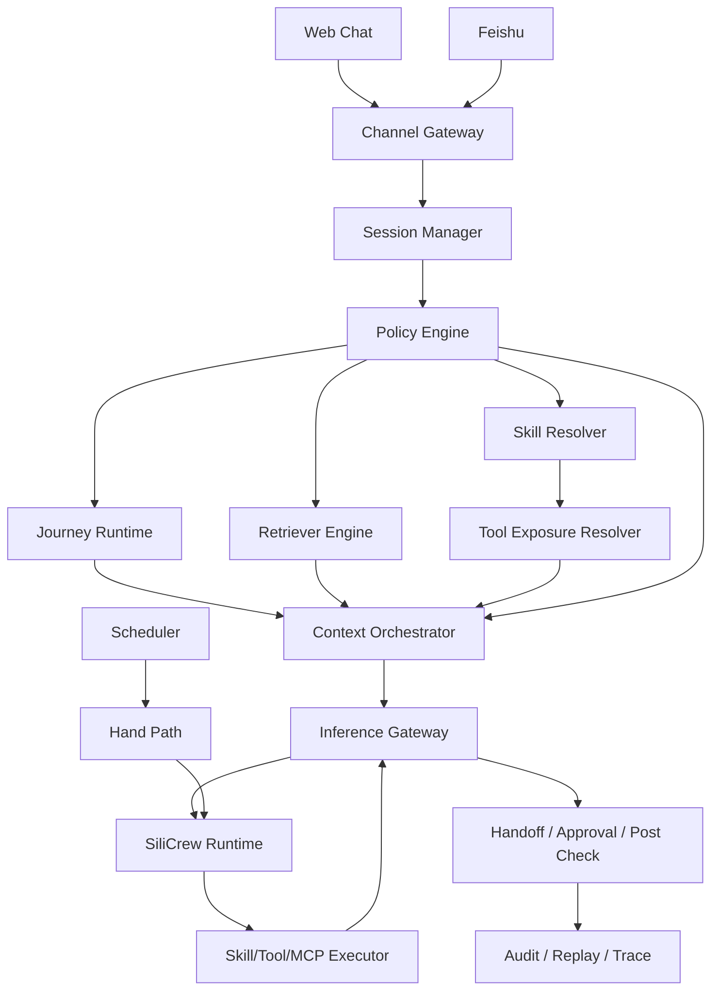
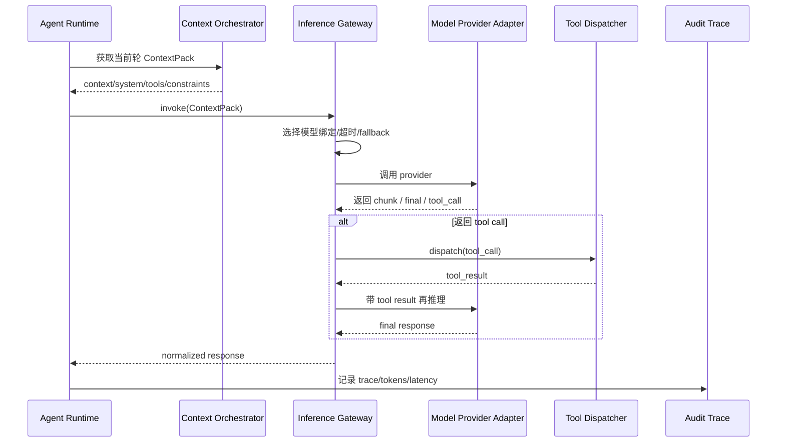

# 基于 SiliCrew 改造的企业级多-Agent 底座（可动工设计）

## 1. 文档目的

本文档给出一版可以直接启动研发的设计方案。总体路线为：

- **Fork SiliCrew**，保留其 Rust 运行时、channel、skill、tool/MCP/A2A、dashboard、API 等基础能力。
- **新增企业控制面**，引入 Parlant(https://github.com/emcie-co/parlant) 风格的 `policy / journey / retriever / tool exposure` 控制逻辑。
- **前后台双路径**：
  - 前台 `Chat Path`：面向 Web Chat、飞书、客服/电销/流程办理场景，强调可控、可审计、可人工接管。
  - 后台 `Hand Path`：继续利用 SiliCrew 的 Hands / scheduler / autonomous execution 能力。

首版采用**极简依赖版**：

- PostgreSQL：主存储
- 可选 Redis：后续补充
- 不引入 Kafka / ClickHouse / OpenTelemetry 作为首版前置依赖

---

## 2. 设计目标

### 2.1 产品目标

构建一个面向企业场景的多-Agent 底座，满足：

1. 支持 **Web Chat 测试界面**
2. 支持 **飞书渠道接入**
3. 支持 **LLM 模型接入管理**
4. 支持 **策略工作台**
5. 支持 **审批 / 人工接管**
6. 支持 **skill 与 tool 同时存在且分层**
7. 支持 **policy / journey / retriever / skill / tool 与模型调用运行时闭环结合**

### 2.2 非目标

首版不追求：

- 全自动自治型复杂 multi-agent DAG 编排器
- 多模型赛马、自动比价路由
- 大规模 OLAP 分析
- 全量统一观测平台

---

## 3. 核心架构原则

### 3.1 SiliCrew 做执行面，不直接定义产品控制面

SiliCrew 当前强项是：

- Rust Agent OS
- Skills / Hands
- Channels
- MCP / A2A
- Dashboard / API
- 安全、预算、运行时治理

因此适合作为**执行内核**。

### 3.2 新增企业控制面

新增一层面向前台会话的控制面，核心对象为：

- `policy`
- `journey`
- `retriever`
- `skill`
- `tool`
- `ContextPack`
- `Inference Gateway`

### 3.3 Skill 与 Tool 分层

- **Skill**：平台能力包。面向管理、复用、部署。
- **Tool**：模型调用接口。面向本轮调用、参数校验、审计与执行。

系统运行时：

1. 先算 `active skills`
2. 再从 active skills 中算 `allowed tools`
3. 模型只看到 `allowed tools`

### 3.4 先编译上下文，再调用模型

运行时遵循：

`policy -> journey -> retriever -> skill resolve -> tool exposure -> ContextPack -> inference`

而不是先让模型自由回答，再做补救。

---

## 4. 总体架构



---

## 5. 两条运行路径

## 5.1 Chat Path

面向：

- Web Chat 测试界面
- 飞书 Bot
- 客服/电销/流程办理
- turn-based 多轮对话

链路：

1. Channel 接入
2. Session 绑定
3. Policy 匹配
4. Journey 解析
5. Retriever 执行
6. Skill 解析
7. Tool 暴露计算
8. ContextPack 编译
9. 模型调用
10. Tool Call 执行
11. 响应后检查
12. Journey 状态推进
13. Trace 落库

## 5.2 Hand Path

面向：

- 定时任务
- 后台巡检
- 长任务
- 异步自治流程

原则：

- 尽量保留 SiliCrew 原生 Hands 机制
- 不与 Chat Path 共用前台强策略控制逻辑
- 底层复用 runtime / skills / channels / audit

---

## 6. 核心对象模型

## 6.1 Policy

职责：

- 检测情境
- 决定哪些规则生效
- 决定哪些 journey 可激活
- 决定哪些 tool 可暴露
- 约束模型行为

建议对象：

- `Observation`
- `Guideline`
- `GuidelineRelationship`
- `PolicyBundle`

## 6.2 Journey

职责：

- 描述业务流程状态
- 提供当前步骤、缺失字段、允许下一步
- 支持推进 / 回退 / 结束 / 转人工

建议对象：

- `Journey`
- `JourneyState`
- `JourneyTransition`
- `JourneyInstance`

## 6.3 Retriever

职责：

- 提供 grounding 知识
- 提供 FAQ / 术语 / 用户特定资料
- 在推理前并行执行

建议对象：

- `RetrieverDefinition`
- `RetrieverBinding`
- `RetrievedChunk`

## 6.4 Skill

职责：

- 管理能力包
- 打包多个 tools
- 管理依赖、权限、版本、运行策略

建议对象：

- `SkillDefinition`
- `SkillVersion`
- `SkillActivationPolicy`

## 6.5 Tool

职责：

- 向模型暴露单个可调用动作
- 提供 schema 与风险边界
- 供运行时做审批、审计和执行

建议对象：

- `ToolDefinition`
- `ToolExposurePolicy`
- `ToolCallRecord`

---

## 7. Policy / Journey / Retriever / Skill / Tool 与模型调用结合设计

本系统不将这五类对象视为平行孤立模块，而将其统一看作模型调用链路上的五类上下文与能力注入机制。

### 7.1 职责划分

- **Policy**：负责情境检测、行为约束、journey/tool 暴露控制与后检查。
- **Journey**：负责提供当前业务流程状态、缺失字段、候选下一步。
- **Retriever**：负责在推理前并行补充知识与 grounding。
- **Skill**：负责组织能力包、运行依赖、权限和版本。
- **Tool**：负责向模型暴露单个可调用动作。

### 7.2 运行时原则

系统遵循“**先编译上下文，再调用模型**”原则。

模型不会直接看到系统中的全部规则、全部流程、全部技能与全部工具，而只看到当前轮最小充分上下文。

### 7.3 ContextPack

```text
ContextPack
- agent_identity
- model_binding
- system_constraints
- active_guidelines
- active_journey
- journey_state
- retrieved_knowledge
- glossary_terms
- context_variables
- active_skills
- allowed_tools
- response_constraints
- audit_meta
```

### 7.4 模型调用阶段

#### 阶段 A：推理前编译

1. observation 匹配与 guideline 冲突消解
2. journey 状态解析
3. retriever 并行执行
4. active skill 计算
5. allowed tools 计算
6. 生成 ContextPack

#### 阶段 B：推理与工具回合

1. 使用 ContextPack 发起首轮模型调用
2. 若模型返回 tool call，则执行 tool
3. 将 tool 结果回填
4. 再次推理得到最终响应

### 7.5 前中后作用点

| 组件 | 推理前 | 推理中 | 推理后 |
|---|---|---|---|
| Policy | 决定规则、journey、tools 是否入上下文 | 约束模型行为 | 合规校验与策略状态更新 |
| Journey | 提供 SOP 状态与下一步候选 | 限定本轮推进目标 | 推进/回退/结束流程 |
| Retriever | 提供 grounding 知识 | 供模型引用 | 记录知识来源 |
| Skill | 计算可用能力包 | 间接影响可见 tools | 供审计与版本追踪 |
| Tool | 计算暴露集合 | 响应模型 tool call | 回写结果进入下一轮推理 |

### 7.6 冲突优先级

优先级顺序：

1. 安全 / 合规 / 人工接管
2. 高优先级 policy
3. active journey 硬约束
4. tool exposure policy
5. retriever grounding
6. agent style / prompt 偏好
7. 模型自由生成空间

---

## 8. Inference Gateway 设计

Inference Gateway 是模型调用网关，位于 ContextPack 之后。

### 8.1 子模块

1. `Model Provider Adapter`
2. `Request Builder`
3. `Response Normalizer`
4. `Tool Call Dispatcher`
5. `Invocation Trace`

### 8.2 运行时能力

首版必须支持：

- 同步调用
- 流式输出
- timeout
- retry
- fallback model
- tool calling
- structured output / json mode
- usage 统计
- trace 记录

### 8.3 时序图



---

## 9. 首版功能模块

## 9.1 Web Chat 测试界面

定位：内部调试与验收入口，而非正式外部客服挂件。

支持：

- 新建 session
- 发送消息
- 流式输出
- 查看命中 policy / journey / retriever / active skills / allowed tools
- 查看 tool call 记录
- 查看 trace
- 模拟人工接管

## 9.2 飞书渠道接入

目标：实现飞书机器人最小闭环。

首版支持：

- 私聊消息接入
- 群聊 @ 机器人接入
- 文本消息收发
- 会话映射
- tenant 绑定
- 基础富文本回复

暂不支持或后补：

- 复杂卡片流编排
- 全量多机器人运营管理

## 9.3 模型接入管理

最小能力：

- Provider 管理
- Model Profile 管理
- 模型别名
- agent / tenant / channel 绑定
- timeout / retry / fallback 配置
- 使用统计

## 9.4 策略工作台

首版对象：

- Observation
- Guideline
- Guideline Relationship
- Journey
- Retriever Binding
- Tool Exposure Policy
- Publish / Rollback

支持：

- CRUD
- 命中测试
- 冲突分析
- 草稿 / 发布 / 回滚

## 9.5 审批 / 人工接管

### 审批

首版支持：

- 高风险 tool 调用审批
- 异步审批状态回写
- 审批记录落库

### 人工接管

首版支持：

- session 切换为 manual mode
- AI 摘要透传给人工
- 工具调用历史可见
- 接管后 AI 不再自动回复

---

## 10. 渠道层设计

## 10.1 Channel Gateway

统一把外部消息适配成 CanonicalMessage。

```text
CanonicalMessage
- channel_type
- tenant_id
- external_user_id
- external_chat_id
- external_message_id
- sender_type
- text
- mentions
- attachments
- timestamp
- raw_payload
```

## 10.2 Web Chat 适配

- 浏览器 -> websocket/http
- session cookie 或临时 user id
- 后端映射到内部 session_id

## 10.3 飞书适配

- 飞书事件 -> CanonicalMessage
- 建立 `tenant/bot/user/chat/session` 映射
- 支持去重、验签、重放保护

---

## 11. Crate 设计

建议在 Fork 后新增以下 crate：

```text
fork-openparlant/
├── crates/
│   ├── openparlant-runtime
│   ├── openparlant-api
│   ├── openparlant-channels
│   ├── openparlant-skills
│   ├── openparlant-kernel
│   ├── openparlant-types
│   ├── openparlant-memory
│   ├── openparlant-session
│   ├── openparlant-policy
│   ├── openparlant-journey
│   ├── openparlant-retriever
│   ├── openparlant-context
│   ├── openparlant-inference
│   ├── openparlant-handoff
│   ├── openparlant-console
│   ├── openparlant-webchat
│   └── openparlant-feishu
├── apps/
│   ├── server
│   ├── worker
│   └── cli
└── web/
    ├── console
    └── webchat
```

### 11.1 保留为主

- `openparlant-runtime`
- `openparlant-api`
- `openparlant-channels`
- `openparlant-skills`
- `openparlant-kernel`
- `openparlant-types`

### 11.2 部分重做

- `openparlant-memory`：迁移为 PostgreSQL-first

### 11.3 重点新增

- `openparlant-policy`
- `openparlant-journey`
- `openparlant-retriever`
- `openparlant-context`
- `openparlant-inference`

---

## 12. 核心 Rust 接口草案

## 12.1 Policy Engine

```rust
pub trait PolicyEngine {
    async fn evaluate(
        &self,
        tenant_id: TenantId,
        session: &SessionState,
        input: &CanonicalMessage,
    ) -> anyhow::Result<PolicyEvaluationResult>;
}
```

## 12.2 Journey Runtime

```rust
pub trait JourneyRuntime {
    async fn resolve(
        &self,
        tenant_id: TenantId,
        session: &SessionState,
        policy: &PolicyEvaluationResult,
    ) -> anyhow::Result<JourneyResolution>;

    async fn transition(
        &self,
        session_id: SessionId,
        decision: JourneyDecision,
    ) -> anyhow::Result<()>;
}
```

## 12.3 Retriever Engine

```rust
pub trait RetrieverEngine {
    async fn retrieve(
        &self,
        tenant_id: TenantId,
        session: &SessionState,
        query: &str,
        bindings: &[RetrieverBinding],
    ) -> anyhow::Result<Vec<RetrievedChunk>>;
}
```

## 12.4 Skill Resolver

```rust
pub trait SkillResolver {
    async fn resolve_active_skills(
        &self,
        tenant_id: TenantId,
        session: &SessionState,
        policy: &PolicyEvaluationResult,
        journey: &JourneyResolution,
    ) -> anyhow::Result<Vec<SkillDefinition>>;
}
```

## 12.5 Tool Exposure Resolver

```rust
pub trait ToolExposureResolver {
    async fn resolve_allowed_tools(
        &self,
        active_skills: &[SkillDefinition],
        policy: &PolicyEvaluationResult,
        journey: &JourneyResolution,
    ) -> anyhow::Result<Vec<ToolDefinition>>;
}
```

## 12.6 Context Orchestrator

```rust
pub trait ContextOrchestrator {
    async fn build_context_pack(
        &self,
        tenant_id: TenantId,
        session: &SessionState,
        policy: PolicyEvaluationResult,
        journey: JourneyResolution,
        retrieved: Vec<RetrievedChunk>,
        active_skills: Vec<SkillDefinition>,
        allowed_tools: Vec<ToolDefinition>,
    ) -> anyhow::Result<ContextPack>;
}
```

## 12.7 Inference Gateway

```rust
pub trait InferenceGateway {
    async fn invoke(&self, req: InferenceRequest) -> anyhow::Result<InferenceResponse>;
    async fn stream(&self, req: InferenceRequest) -> anyhow::Result<InferenceStreamHandle>;
}
```

---

## 13. PostgreSQL 表设计（首版）

## 13.1 会话与消息

### sessions
- session_id
- tenant_id
- channel_type
- external_user_id
- external_chat_id
- status
- active_journey_instance_id
- manual_mode
- created_at
- updated_at

### messages
- message_id
- session_id
- role
- content
- raw_payload
- created_at

## 13.2 Policy

### observations
- observation_id
- tenant_id
- name
- matcher_type
- matcher_config
- priority
- enabled

### guidelines
- guideline_id
- tenant_id
- condition_ref
- action_text
- duration
- priority
- enabled

### guideline_relationships
- id
- from_guideline_id
- to_guideline_id
- relation_type

## 13.3 Journey

### journeys
- journey_id
- tenant_id
- name
- trigger_config
- completion_rule
- enabled

### journey_states
- state_id
- journey_id
- name
- description
- required_fields

### journey_transitions
- transition_id
- journey_id
- from_state_id
- to_state_id
- condition_config

### journey_instances
- journey_instance_id
- session_id
- journey_id
- current_state_id
- status
- state_payload
- updated_at

## 13.4 Retriever

### retrievers
- retriever_id
- tenant_id
- name
- retriever_type
- config_json
- enabled

### retriever_bindings
- id
- tenant_id
- retriever_id
- bind_type
- bind_ref

## 13.5 Skill / Tool

### skills
- skill_id
- tenant_id
- name
- version
- runtime_type
- description
- enabled

### tools
- tool_id
- skill_id
- name
- description
- input_schema
- output_schema
- risk_level
- approval_mode
- enabled

### skill_activation_policies
- id
- skill_id
- trigger_type
- trigger_ref
- activation_rule

### tool_exposure_policies
- id
- tool_id
- journey_state_ref
- policy_ref
- exposure_rule
- requires_approval

## 13.6 模型接入

### providers
- provider_id
- tenant_id
- name
- base_url
- auth_ref
- enabled

### model_profiles
- model_profile_id
- provider_id
- alias
- model_name
- timeout_ms
- temperature
- max_tokens
- retry_policy
- fallback_profile_id
- enabled

### model_bindings
- binding_id
- tenant_id
- bind_scope
- bind_ref
- model_profile_id
- priority

## 13.7 运行时调用

### inference_requests
- request_id
- tenant_id
- session_id
- agent_id
- model_profile_id
- context_pack_hash
- status
- created_at

### inference_results
- result_id
- request_id
- finish_reason
- input_tokens
- output_tokens
- latency_ms
- retry_count
- fallback_from
- raw_response_ref
- created_at

### tool_call_records
- tool_call_id
- request_id
- skill_id
- tool_id
- arguments_json
- approval_status
- execution_status
- latency_ms
- result_ref
- created_at

## 13.8 审批 / 人工接管

### approvals
- approval_id
- tenant_id
- session_id
- tool_call_id
- approval_type
- status
- approver_id
- created_at
- updated_at

### handoff_records
- handoff_id
- tenant_id
- session_id
- reason
- summary
- status
- created_at
- updated_at

---

## 14. API 设计（首版）

## 14.1 Web Chat Runtime API

### POST /api/webchat/sessions
创建 session

### POST /api/webchat/sessions/{session_id}/messages
发送消息

### GET /api/webchat/sessions/{session_id}/stream
流式拉取回复

### GET /api/webchat/sessions/{session_id}/trace
查看 trace

### POST /api/webchat/sessions/{session_id}/handoff
触发人工接管

## 14.2 飞书事件入口

### POST /api/channels/feishu/events
接收飞书事件回调

### POST /api/channels/feishu/actions
接收飞书交互操作

## 14.3 模型接入管理 API

### POST /api/console/providers
### POST /api/console/model-profiles
### POST /api/console/model-bindings
### GET /api/console/model-usage

## 14.4 策略工作台 API

### POST /api/console/observations
### POST /api/console/guidelines
### POST /api/console/journeys
### POST /api/console/retrievers
### POST /api/console/tool-exposure-policies
### POST /api/console/releases/publish
### POST /api/console/releases/rollback

## 14.5 审批 / 人工接管 API

### POST /api/console/approvals/{approval_id}/approve
### POST /api/console/approvals/{approval_id}/reject
### POST /api/console/handoffs/{session_id}/accept
### POST /api/console/handoffs/{session_id}/resume-ai

---

## 15. 管理台页面

首版页面建议：

1. **Web Chat 测试台**
2. **模型接入管理**
3. **Observation 管理**
4. **Guideline 管理**
5. **Journey 管理**
6. **Retriever 绑定管理**
7. **Skill / Tool 管理**
8. **发布与回滚中心**
9. **审批中心**
10. **人工接管台**
11. **Session Replay / Trace**
12. **飞书渠道配置**

---

## 16. 实施计划

## Phase 1：Fork 与骨架建立（1~2 周）

目标：

- Fork SiliCrew
- 锁定 commit
- 跑通 server / dashboard / API
- 建立新增 crates 空壳

交付：

- 仓库初始化
- 新增 crate 目录
- 基础构建通过

## Phase 2：Chat Path 最小闭环（2~3 周）

目标：

- session-manager
- policy-engine
- journey-runtime
- retriever-engine
- context-orchestrator
- inference-gateway
- webchat 最小可用

交付：

- Web Chat 能发消息并获得模型回复
- trace 可查看

## Phase 3：Skill / Tool / 审批（2~3 周）

目标：

- skill resolve
- tool exposure resolve
- tool call dispatch
- approval gate

交付：

- 模型可调用受控 tool
- 高风险 tool 走审批

## Phase 4：飞书接入与人工接管（2 周）

目标：

- 飞书最小链路
- handoff
- manual mode

交付：

- 飞书机器人会话打通
- 人工接管可用

## Phase 5：策略工作台与模型管理 MVP（2 周）

目标：

- observation/guideline/journey/retriever/tool policy CRUD
- provider/model/profile/binding CRUD
- publish/rollback

交付：

- 内部可运营的控制台 MVP

---

## 17. 当前拍板建议

建议立即拍板以下事项：

1. **Fork SiliCrew，锁 commit，不直接跟主干滚动升级**
2. **前台 Chat Path 单独建设，不复用 SiliCrew 原生 Hands-first 路径**
3. **Skill 与 Tool 分层**
4. **首版采用 PostgreSQL-first 极简依赖**
5. **先用 Web Chat 跑通，再做飞书生产化**

---

## 18. 下一步建议

下一步最适合继续补：

1. PostgreSQL DDL SQL 文件
2. Rust crate 目录脚手架
3. 核心 trait 与 DTO 代码骨架
4. Web Chat 页面原型
5. 飞书事件流时序图

