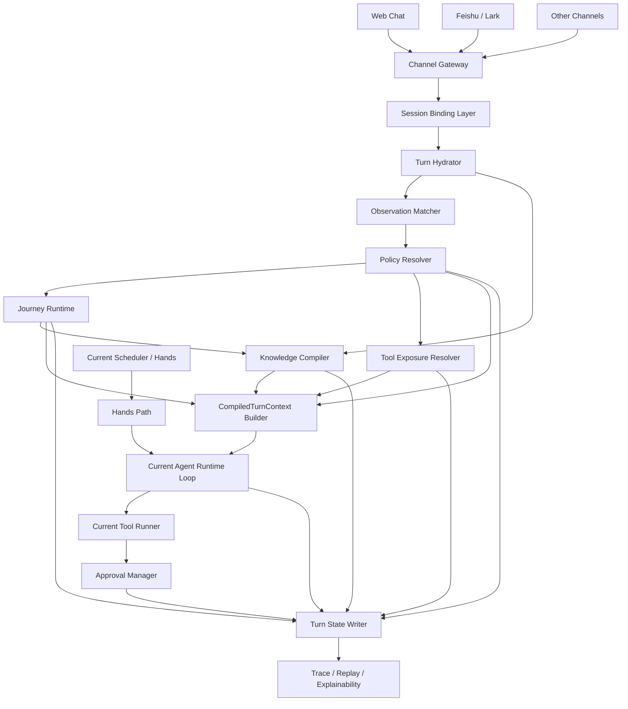

# 基于 OpenFang / OpenParlant 的企业级多-Agent 底座设计 v3（增量演进版）

## 1. 文档定位

本文档用于替代 v2 设计稿，吸收以下两份材料后的统一结论：

- `docs/基于OpenFang改造的企业级多Agent底座-可动工设计-v2.md`
- `docs/建议.md`

本版不再把目标表述为“直接把 Parlant 和 OpenFang 硬合并”，也不再把项目定义为“完全新写一套 Rust 底座”。本版明确采用：

- **以当前仓库为执行基座**
- **以 Parlant 的语义控制模型为上层控制面**
- **按当前代码现实做增量演进**

一句话定义：

**在当前 OpenFang/OpenParlant Rust 仓库上，增量加入 Parlant 风格的 conversational control layer，先做出企业可控的前台对话底座，再逐步扩展到完整企业 Agent OS。**

---

## 2. 与 v2 相比的关键修正

### 2.1 战略修正

v2 的主要问题不是方向错，而是把三件不同难度的事情写成了一件事：

1. 在现有仓库上增量改造
2. 引入 Parlant 风格控制面
3. 同时完成 PostgreSQL-first、多租户、企业治理平台化

这三件事不能在同一阶段等权推进。

### 2.2 本版拍板修正

本版做以下明确修正：

1. **不再把 MVP 定义为 PostgreSQL-first，而是 SQLite-first / PostgreSQL-ready**
2. **不再把 WebChat / Feishu / approvals / sessions 写成从零开发能力，而是复用现有能力并扩展**
3. **不再在 MVP 中新造一套独立 Inference Gateway 取代现有 runtime loop**
4. **补齐 Parlant 关键对象：glossary / variables / canned responses / explainability**
5. **把 tenant-first 改为 scope-first**
6. **MVP 只做单前台 agent 为主，支持有限 specialist delegation，不做完整 planner/verifier 多 agent 编排**
7. **前台 Chat Path 与后台 Hands Path 分层，但底层 runtime / tool runner / approval / channel / audit 复用**

### 2.3 何时本版失效

如果团队决定以下任一事项，则本版需要整体重写：

- 决定从当前仓库完全分叉重做新 workspace
- 决定首版必须 day-1 支持真正的多租户强隔离和 PostgreSQL 全替换
- 决定首版必须做复杂多-agent planner / verifier / DAG orchestration

---

## 3. 当前仓库基线

本设计必须建立在当前仓库真实能力之上，而不是抽象想象之上。

### 3.1 当前已经存在的执行基座能力

- Rust workspace，crate 已以 `openparlant-*` 命名
- 现成 agent loop、prompt builder、tool runner、LLM driver
- 现成 session API、多 session 管理、WebChat UI
- 现成 approvals API 与 ApprovalManager
- 现成 Feishu / Lark channel adapter
- 现成 skills / hands / scheduler / MCP / A2A 基础设施

### 3.2 当前已经存在但必须尊重的约束

- memory / session / usage / knowledge 当前以 **SQLite** 为核心存储
- session 当前核心维度是 `agent_id + session_id`，不是 tenant-first
- prompt 组装和 tool execution 已深嵌到 runtime 中
- 现有 dashboard / API / routes 已有大量页面和端点，不能轻易并行造第二套

### 3.3 因此本版的工程原则

1. **先在现有 runtime 前面加控制面，不先重写 runtime**
2. **先在现有 SQLite 上增加控制面状态，不先整体迁移 PG**
3. **先沿用现有 API 与 UI，逐步扩展，不先并行起新 apps/server/worker/cli**
4. **先实现“对话可控”，再实现“企业平台化”**

---

## 4. 总体定位

目标底座定义为：

**面向企业生产场景的多-Agent 语义控制与执行操作系统。**

系统分三层：

### 4.1 语义控制层

来源于 Parlant 的设计哲学，负责：

- 识别当前轮发生了什么
- 判定哪些规则生效
- 判定哪些 SOP / journey 激活
- 判定哪些工具、知识、词汇、变量应该进入上下文
- 决定是否进入严格输出或 canned response 模式

### 4.2 执行运行层

来源于当前 OpenFang/OpenParlant 仓库，负责：

- agent loop
- LLM 调用
- tool execution
- approval gate
- skills / hands / MCP / A2A
- session 持久化
- channels
- scheduler

### 4.3 企业治理层

这是需要逐步补强的部分，负责：

- scope / tenant 治理
- 版本发布与回滚
- 审批与人工接管
- trace / replay / explainability
- 成本与预算治理
- 敏感信息和合规治理

---

## 5. 核心设计原则

### 5.1 先编译控制上下文，再调用模型

每轮消息先进入控制面，控制面先产出一个 **CompiledTurnContext**，再把它交给现有 runtime loop。

运行顺序为：

`channel ingress -> session hydrate -> observation match -> policy resolve -> journey resolve -> retriever/glossary/variables compile -> tool exposure resolve -> compiled turn context -> current agent loop`

### 5.2 Tool 默认不可见，按条件暴露

模型不能默认看到系统里的全部工具。

每轮只暴露：

- 当前 rules 允许的工具
- 当前 journey state 允许的工具
- 当前 observation 命中的工具
- 当前 approval policy 可接受的工具

**实现说明（兼容模式）**：在 `tool_exposure_policies` 的 SQLite 实现中，若某个 **scope 下尚无任何 tool policy 记录**，则该 scope 被视为**未接入控制面工具治理**，工具门控对候选工具保持 **legacy「无匹配策略则放行」**，以免破坏未配置策略的现有部署。一旦为该 scope **创建了任意一条** tool policy，该 scope 即切换为 **控制面托管模式（deny-by-default）**：仅匹配策略的工具可见，其余拒绝。这与上文「理想产品语义」的差异是刻意的迁移兼容策略；若需从首条配置起就等价于「默认不可见」，应在创建 scope 后立即添加覆盖所用工具名的策略（或后续提供显式 scope 级开关）。

### 5.3 Chat Path 与 Hands Path 分层

- **Chat Path**：前台 turn-based 对话，低延迟、强审计、强控制
- **Hands Path**：后台异步自治、定时任务、长作业

二者共享：

- runtime
- tool runner
- approval
- channels
- audit

二者不共享：

- 前台强策略编译逻辑
- 前台 strict composition 与 canned response 约束
- 前台 handoff / manual mode 流程

### 5.4 MVP 只做“可控前台对话”，不追求完整多-agent 编排

MVP 支持：

- 单 foreground agent
- 有限 specialist delegation
- 受控 tools
- 明确 trace

MVP 不支持：

- planner / verifier / recovery agent 成体系编排
- 大型多-agent DAG
- 通用自治协同平台

### 5.5 命名保持仓库一致

当前 workspace 已使用 `openparlant-*` crate 命名。

因此本版拍板：

- **crate 命名继续沿用 `openparlant-*`**
- 产品层可以继续使用 “OpenFang 企业版 / 企业底座” 叙事
- 不再混用 `openparlant-*`、`openparlant-*`、`openparlantos-*` 三套 crate 名

---

## 6. 目标架构




---

## 7. 分层与模块职责


| 层   | 模块                              | 职责                                                    | MVP 实现策略                      |
| --- | ------------------------------- | ----------------------------------------------------- | ----------------------------- |
| 接入层 | Channel Gateway                 | 渠道消息接入与标准化                                            | 复用现有 channels 和 adapters      |
| 会话层 | Session Binding Layer           | 外部会话映射到内部 session                                     | 新增绑定表，尽量不改现有 session 主表       |
| 控制层 | Observation Matcher             | 检测当前轮语义信号                                             | 新增 crate                      |
| 控制层 | Policy Resolver                 | 规则匹配、冲突消解、关系处理                                        | 新增 crate                      |
| 控制层 | Journey Runtime                 | SOP 状态推进与约束计算                                         | 新增 crate                      |
| 控制层 | Knowledge Compiler              | retriever / glossary / variables / canned response 编译 | 新增 crate                      |
| 控制层 | Tool Exposure Resolver          | 计算本轮 allowed tools 与 approval requirements            | 新增 crate                      |
| 执行层 | Current Agent Runtime Loop      | LLM 调用、消息循环、工具回填                                      | 复用当前 runtime                  |
| 执行层 | Current Tool Runner             | tool 执行与 allowlist enforcement                        | 复用当前 tool runner              |
| 治理层 | Approval Manager                | 人工审批                                                  | 复用当前 approval manager，扩展上下文来源 |
| 治理层 | Trace / Replay / Explainability | 记录本轮为什么这么做                                            | 新增 trace 表与 UI 面板             |


---

## 8. 核心运行闭环

### 8.1 Channel ingress

渠道消息统一转成：

```text
CanonicalMessage
- channel_type
- scope_id
- external_user_id
- external_chat_id
- external_message_id
- sender_type
- text
- attachments
- mentions
- raw_payload
- received_at
```

说明：

- 本版使用 `scope_id`，而不是在 MVP 阶段强推全链路 `tenant_id`
- `scope_id` 在单租户模式下默认为 `default`
- 后续如果进入真正多租户阶段，`scope_id` 再映射为严格 `tenant_id`

### 8.2 Session hydrate

本阶段不强改现有 `sessions` 主表，而新增一个绑定层：

```text
SessionBinding
- binding_id
- scope_id
- channel_type
- external_user_id
- external_chat_id
- agent_id
- session_id
- manual_mode
- active_journey_instance_id
- last_message_at
```

作用：

- 让控制面拥有 scope / channel / external identity 维度
- 不强行改写现有 runtime 的 session 假设
- 为后续多租户迁移保留兼容层

### 8.3 Observation matching

先做两类 matcher：

1. deterministic matcher
2. semantic matcher

MVP 原则：

- deterministic 优先
- semantic 只做补充，不做主判官
- matcher 的输出是结构化 observation hit，不是 prompt 文本

### 8.4 Policy resolve

规则关系支持：

- `depends_on`
- `excludes`
- `prioritizes_over`

目标：

- 输出当前轮真正生效的 guideline 集
- 记录哪些 guideline 被排除及其原因

### 8.5 Journey resolve

journey 采用“显式状态 + 软跳转候选 + 约束检查”的模式。

MVP 支持：

- 激活
- 推进
- 回退
- 完成
- 转人工

MVP 不支持：

- 复杂跨 journey 编排
- 后台 DAG 风格自治流程

### 8.6 Knowledge compile

本阶段统一编译四类信息：

- retriever results
- glossary terms
- context variables
- canned response candidates

说明：

- glossary 与 variables 不再作为隐含字段存在，而是控制面一等对象
- canned responses 只在被规则或 strict mode 激活时进入本轮上下文

### 8.7 Tool exposure resolve

输出：

- `allowed_tools`
- `tool_authorization_reasons`
- `approval_required_tools`

计算来源：

- active observations
- active guidelines
- active journey state
- skill/tool binding
- global approval policy

### 8.8 Current agent runtime loop

MVP 中不新造独立 Inference Gateway 取代现有 loop。

本版采用：

- 控制面先生成 `CompiledTurnContext`
- 将其转成 runtime 可消费的 prompt sections / tool allowlist / response mode
- 继续复用现有 `agent_loop + prompt_builder + tool_runner`

### 8.9 Turn state update

每轮结束后必须记录：

- observation hits
- active guidelines
- excluded guidelines
- journey state before / after
- retriever hits
- glossary / variables 注入情况
- allowed tools
- 实际 tool calls
- approval decisions
- response mode
- 最终答复

---

## 9. 核心对象模型

### 9.1 Observation

职责：

- 检测某种情境是否成立
- 为规则、journey、tool 暴露提供前置条件

建议字段：

- `observation_id`
- `scope_id`
- `name`
- `matcher_type`
- `matcher_config`
- `priority`
- `enabled`

### 9.2 Guideline

职责：

- 描述行为规则
- 决定该说什么、不该说什么、如何说

建议字段：

- `guideline_id`
- `scope_id`
- `name`
- `condition_ref`
- `action_text`
- `composition_mode`
- `priority`
- `enabled`

### 9.3 GuidelineRelationship

职责：

- 处理规则之间的依赖、互斥和优先级

建议关系：

- `depends_on`
- `excludes`
- `prioritizes_over`

### 9.4 Journey

职责：

- 表达前台业务 SOP
- 提供当前 state、缺失字段、允许动作、完成条件

建议对象：

- `Journey`
- `JourneyState`
- `JourneyTransition`
- `JourneyInstance`

### 9.5 Retriever

职责：

- 在回答前补充 grounding 知识
- 面向 FAQ、知识库、用户资料、业务知识

### 9.6 GlossaryTerm

职责：

- 提供领域术语解释
- 将用户表达映射到业务词汇

### 9.7 ContextVariable

职责：

- 提供当前轮可注入变量
- 例如用户级变量、会话级变量、流程级变量、租户级变量

### 9.8 CannedResponse

职责：

- 在高风险或需严格措辞时提供预先批准的话术模板

### 9.9 Skill

职责：

- 继续作为平台能力包
- 管理 tool 分组、运行依赖、版本、部署策略

说明：

- skill 继续沿用现有平台定义
- 本版不再重新发明 skill 概念

### 9.10 ToolAuthorization

职责：

- 表示某个 tool 为什么在本轮可见
- 为 explainability 与审计提供依据

### 9.11 CompiledTurnContext

```text
CompiledTurnContext
- scope_id
- agent_id
- session_id
- canonical_message
- active_observations
- active_guidelines
- excluded_guidelines
- active_journey
- journey_state
- retrieved_chunks
- glossary_terms
- context_variables
- canned_response_candidates
- active_skills
- allowed_tools
- tool_authorization_reasons
- response_mode
- audit_meta
```

---

## 10. MVP 范围

## 10.1 In Scope

- 基于现有 WebChat 的内部调试入口
- 基于现有 Feishu / Lark adapter 的最小闭环
- observation / guideline / relationship
- journey runtime
- retriever / glossary / variables
- tool exposure control
- approval reuse + contextual approval reason
- policy explainability / trace / replay
- manual mode / human handoff 最小闭环
- 单 foreground agent
- 有限 specialist delegation

## 10.2 Out of Scope

- PostgreSQL 全面替换 SQLite
- day-1 真多租户强隔离
- 全量模型接入平台化管理
- planner / verifier / recovery agent 体系
- 复杂 DAG 工作流编排
- 新建独立 console / webchat / server / worker 应用
- Kafka / ClickHouse / OpenTelemetry 平台化接入
- 覆盖大量新渠道

---

## 11. 存储策略

### 11.1 存储拍板

MVP 存储策略调整为：

**SQLite-first / PostgreSQL-ready**

原因：

- 当前仓库 memory/session/config 深度依赖 SQLite
- 如果首版就切 PostgreSQL，工程重心会被基础迁移吞掉
- 控制面可以先在 SQLite 上验证模型与产品闭环

### 11.2 控制面表设计（MVP）

#### control_scopes

- `scope_id`
- `name`
- `scope_type`
- `status`
- `created_at`
- `updated_at`

#### session_bindings

- `binding_id`
- `scope_id`
- `channel_type`
- `external_user_id`
- `external_chat_id`
- `agent_id`
- `session_id`
- `manual_mode`
- `active_journey_instance_id`
- `created_at`
- `updated_at`

#### observations

- `observation_id`
- `scope_id`
- `name`
- `matcher_type`
- `matcher_config`
- `priority`
- `enabled`

#### guidelines

- `guideline_id`
- `scope_id`
- `name`
- `condition_ref`
- `action_text`
- `composition_mode`
- `priority`
- `enabled`

#### guideline_relationships

- `relationship_id`
- `scope_id`
- `from_guideline_id`
- `to_guideline_id`
- `relation_type`

#### journeys

- `journey_id`
- `scope_id`
- `name`
- `trigger_config`
- `completion_rule`
- `enabled`

#### journey_states

- `state_id`
- `journey_id`
- `name`
- `description`
- `required_fields`

#### journey_transitions

- `transition_id`
- `journey_id`
- `from_state_id`
- `to_state_id`
- `condition_config`
- `transition_type`

#### journey_instances

- `journey_instance_id`
- `scope_id`
- `session_id`
- `journey_id`
- `current_state_id`
- `status`
- `state_payload`
- `updated_at`

#### retrievers

- `retriever_id`
- `scope_id`
- `name`
- `retriever_type`
- `config_json`
- `enabled`

#### retriever_bindings

- `binding_id`
- `scope_id`
- `retriever_id`
- `bind_type`
- `bind_ref`

#### glossary_terms

- `term_id`
- `scope_id`
- `name`
- `description`
- `synonyms_json`
- `enabled`

#### context_variables

- `variable_id`
- `scope_id`
- `name`
- `value_source_type`
- `value_source_config`
- `visibility_rule`
- `enabled`

#### canned_responses

- `response_id`
- `scope_id`
- `name`
- `template_text`
- `trigger_rule`
- `enabled`

#### tool_exposure_policies

- `policy_id`
- `scope_id`
- `tool_name`
- `skill_ref`
- `observation_ref`
- `journey_state_ref`
- `guideline_ref`
- `approval_mode`
- `enabled`

#### control_releases

- `release_id`
- `scope_id`
- `version`
- `status`
- `published_by`
- `created_at`

#### turn_traces

- `trace_id`
- `scope_id`
- `session_id`
- `agent_id`
- `channel_type`
- `request_message_ref`
- `compiled_context_hash`
- `response_mode`
- `created_at`

#### policy_match_records

- `record_id`
- `trace_id`
- `observation_hits_json`
- `guideline_hits_json`
- `guideline_exclusions_json`

#### journey_transition_records

- `record_id`
- `trace_id`
- `journey_instance_id`
- `before_state_id`
- `after_state_id`
- `decision_json`

#### tool_authorization_records

- `record_id`
- `trace_id`
- `allowed_tools_json`
- `authorization_reasons_json`
- `approval_requirements_json`

#### handoff_records

- `handoff_id`
- `scope_id`
- `session_id`
- `reason`
- `summary`
- `status`
- `created_at`
- `updated_at`

### 11.3 PostgreSQL 迁移时机

只有满足以下任一条件时，才进入 PostgreSQL 专题：

- 需要真正多租户隔离
- SQLite 锁竞争和数据量明显成为瓶颈
- 需要复杂查询、权限、报表或横向扩展

进入该阶段时，再把 runtime legacy tables 和 control-plane tables 一起迁移，不做半吊子双存储。

---

## 12. 模块与 crate 规划

### 12.1 继续复用的现有 crates

- `openparlant-runtime`
- `openparlant-api`
- `openparlant-kernel`
- `openparlant-memory`
- `openparlant-channels`
- `openparlant-skills`
- `openparlant-hands`
- `openparlant-types`

### 12.2 MVP 新增 crates

#### `openparlant-policy`

负责：

- observation matcher
- guideline resolution
- relationship graph

#### `openparlant-journey`

负责：

- journey DSL
- state resolution
- transition evaluation

#### `openparlant-context`

负责：

- retriever orchestration
- glossary compile
- variable resolution
- canned response resolution
- compiled context sections

#### `openparlant-control`

负责：

- 将 policy / journey / context / tool exposure 串起来
- 输出 `CompiledTurnContext`
- 写入 explainability records

### 12.3 暂不新增的模块

以下模块先不单独拆 crate：

- `openparlant-inference`
- `openparlant-console`
- `openparlant-webchat`
- `openparlant-feishu`
- `apps/server`
- `apps/worker`
- `apps/cli`

原因：

- 当前仓库已有 API、UI、channel、CLI
- MVP 阶段先在现有面上扩展，避免平行建设

---

## 13. 与现有 runtime 的集成方式

### 13.1 集成原则

控制面不是新的 agent loop。

控制面的职责是：

- 在调用 loop 之前编译上下文
- 在调用 loop 之后记录解释与状态

### 13.2 推荐接口

```rust
pub struct TurnInput {
    pub scope_id: String,
    pub agent_id: AgentId,
    pub session_id: SessionId,
    pub message: CanonicalMessage,
}

pub struct CompiledTurnContext {
    pub system_constraints: Vec<String>,
    pub active_guidelines: Vec<GuidelineActivation>,
    pub active_journey: Option<JourneyActivation>,
    pub retrieved_chunks: Vec<RetrievedChunk>,
    pub glossary_terms: Vec<GlossaryTerm>,
    pub context_variables: Vec<ResolvedVariable>,
    pub canned_response_candidates: Vec<CannedResponse>,
    pub allowed_tools: Vec<String>,
    pub response_mode: ResponseMode,
    pub audit_meta: AuditMeta,
}

pub trait TurnControlCoordinator {
    async fn compile_turn(&self, input: TurnInput) -> anyhow::Result<CompiledTurnContext>;

    async fn after_response(
        &self,
        trace_id: TraceId,
        response: &AgentLoopResult,
        tool_calls: &[ToolCallRecord],
    ) -> anyhow::Result<()>;
}
```

### 13.3 运行接入点

控制面输出接入现有 runtime 的三类内容：

1. `system prompt additions`
2. `allowed_tools`
3. `response mode / canned response constraints`

这意味着 MVP 中：

- 保留当前 prompt builder
- 保留当前 agent loop
- 保留当前 tool runner
- 只在其输入前增加控制面编译步骤

---

## 14. API 设计（修正版）

### 14.1 继续复用的现有 API

继续沿用当前端点：

- `POST /api/agents/{id}/message`
- `POST /api/agents/{id}/message/stream`
- `GET /api/agents/{id}/session`
- `GET /api/sessions`
- `GET /api/approvals`
- `POST /api/approvals/{id}/approve`
- `POST /api/approvals/{id}/reject`

说明：

- MVP **不新增** `POST /api/webchat/sessions` 这类平行接口
- WebChat 继续建立在现有 agent/session API 上

### 14.2 新增控制面 API

#### Policy / Context

- `POST /api/control/scopes`
- `POST /api/control/observations`
- `POST /api/control/guidelines`
- `POST /api/control/guideline-relationships`
- `POST /api/control/retrievers`
- `POST /api/control/glossary-terms`
- `POST /api/control/context-variables`
- `POST /api/control/canned-responses`

#### Journey

- `POST /api/control/journeys`
- `POST /api/control/journeys/{journey_id}/states`
- `POST /api/control/journeys/{journey_id}/transitions`

#### Publish / Rollback

- `POST /api/control/releases/publish`
- `POST /api/control/releases/rollback`

#### Trace / Explainability

- `POST /api/control/test/compile-turn`
- `GET /api/sessions/{session_id}/control-trace`
- `GET /api/sessions/{session_id}/journey-state`

#### Handoff / Manual Mode

- `POST /api/sessions/{session_id}/manual-mode`
- `POST /api/sessions/{session_id}/resume-ai`
- `POST /api/sessions/{session_id}/handoff`

### 14.3 Feishu 接入

MVP 不新建独立 Feishu 服务。

采用：

- 继续复用现有 Feishu / Lark adapter
- 在 adapter 入站后增加 session binding 与 control-plane compile 阶段

---

## 15. 管理台与调试台

### 15.1 WebChat 调试台

基于现有 WebChat 扩展以下面板：

- 命中的 observations
- 生效 / 被排除的 guidelines
- 当前 active journey 与 state
- retriever / glossary / variables
- allowed tools 与授权原因
- tool calls
- approval 状态
- 最终 response mode

### 15.2 控制台页面

MVP 页面建议：

1. WebChat 调试台
2. Observation 管理
3. Guideline 与 Relationship 管理
4. Journey 管理
5. Retriever / Glossary / Variables 管理
6. Tool Exposure Policy 管理
7. Release 管理
8. Approvals 与 Handoff
9. Session Replay / Explainability
10. Channel 配置扩展页

### 15.3 本版不单独建设新前端应用

说明：

- 不新开 `web/console`
- 不新开 `web/webchat`
- 优先扩展现有 dashboard / static pages

---

## 16. 实施计划

## Phase 0：拍板与骨架确认（2~3 天）

目标：

- 锁定本版架构
- 确认 SQLite-first
- 确认 crate 命名沿用 `openparlant-*`
- 确认 MVP 不做复杂多-agent 编排

交付：

- v3 设计稿确认
- 新 crate 清单确认
- API 扩展清单确认

## Phase 1：控制面骨架与 trace 基础（1~2 周）

目标：

- 建立 `openparlant-policy`
- 建立 `openparlant-journey`
- 建立 `openparlant-context`
- 建立 `openparlant-control`
- 建立控制面 SQLite 表
- 打通 `compile_turn -> current runtime loop`

交付：

- 能在 WebChat 里看到编译后的 `CompiledTurnContext`
- 能保存 turn trace

## Phase 2：Policy / Journey / Knowledge MVP（2~3 周）

目标：

- observation/guideline/relationship
- journey runtime
- retriever / glossary / variables
- explainability 基础 UI

交付：

- WebChat 可见 rules / journeys / knowledge 注入结果
- 具备最小的前台可控回答能力

## Phase 3：Tool Gate / Approval / Handoff（2~3 周）

目标：

- tool exposure resolver
- canned responses
- contextual approval
- manual mode / handoff

交付：

- 模型只见到条件允许工具
- 高风险调用走审批
- 会话可切 manual mode

## Phase 4：Feishu 生产化接入（1~2 周）

目标：

- 复用现有 Feishu/Lark adapter
- 补 session binding
- 补渠道 trace 与 handoff 联动

交付：

- 飞书私聊 / 群聊 @ 机器人最小闭环

## Phase 5：治理与平台化专题（另立专题）

目标：

- 多租户真正落地
- PostgreSQL 迁移
- 策略版本化完善
- hands 与前台控制面更深整合
- 成本 / 配额 / 合规 / 报表

说明：

- 该阶段不再归入 MVP

---

## 17. 主要风险

### 17.1 SQLite 低估风险

如果团队嘴上接受 SQLite-first，实施中又不断插入“顺便把 PG 一起做”，项目会失控。

### 17.2 scope 与 tenant 概念漂移

如果文档和代码里混着写 `scope_id` 和 `tenant_id`，后续治理边界会混乱。

处理原则：

- MVP 一律写 `scope_id`
- 真进入多租户阶段再做严格 tenant 语义收敛

### 17.3 控制面与现有 prompt 逻辑双写

如果一部分规则进入 `CompiledTurnContext`，另一部分还散落在原 prompt builder 里，后面会难以解释和调试。

处理原则：

- 所有新增前台控制逻辑统一进入 control-plane compile
- 现有 prompt builder 只保留平台级固定段落

### 17.4 Chat Path 与 Hands Path 分叉过大

如果前台和后台各自演化成两套能力体系，维护成本会持续升高。

处理原则：

- 底层执行共享
- 上层控制分层

### 17.5 UI 范围膨胀

如果一开始就想做完整运营工作台，MVP 会被拖死。

处理原则：

- 先做调试可见
- 再做运营可配置

---

## 18. 当前拍板建议

建议立即拍板以下事项：

1. **采用 v3，冻结 v2，不再继续在 v2 上修补**
2. **MVP 采用 SQLite-first / PostgreSQL-ready**
3. **crate 命名保持 `openparlant-*`**
4. **复用现有 WebChat / Feishu / approvals / sessions / runtime**
5. **MVP 只做单 foreground agent + 有限 delegation**
6. **控制面一等对象必须包含 glossary / variables / canned responses / explainability**
7. **Chat Path 与 Hands Path 分层，但底层执行面共享**

---

## 19. 下一步建议

下一步最适合继续补的不是 PRD，而是直接进入工程骨架：

1. 新增 `openparlant-policy`
2. 新增 `openparlant-journey`
3. 新增 `openparlant-context`
4. 新增 `openparlant-control`
5. 生成 SQLite migration
6. 定义 `CompiledTurnContext` 与 `TurnControlCoordinator`
7. 在现有 WebChat 中先接一版只读 trace 面板

如果按这个顺序推进，项目会先形成“控制面接上现有执行面”的最小闭环，而不是先陷入基础设施重构。